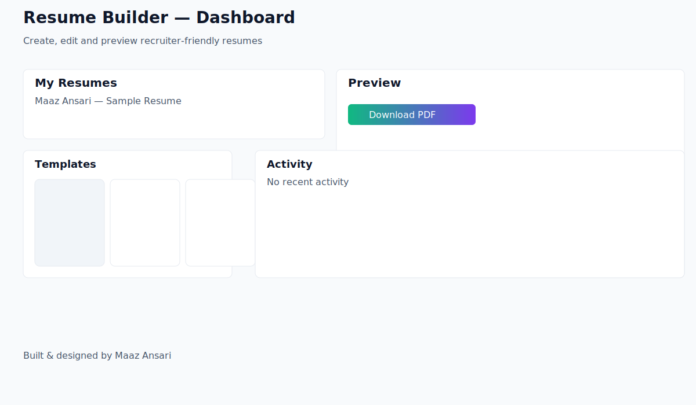
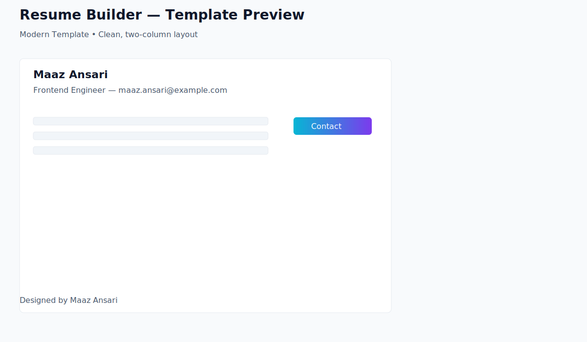

# ResumeForge AI

ResumeForge AI is a polished, lightweight web app for creating modern, recruiter-friendly resumes quickly. It combines a clean visual editor with AI-assisted enhancements so you can produce tailored resumes in minutes.

Built & maintained by **Maaz Ansari**

Portfolio: https://portfolio-rose-ten-h8vdzjp4ol.vercel.app/ • Email: maazansari25667@gmail.com • GitHub: https://github.com/AnsariTech-25667

## Demo

Live demo: (deploy this repository to a static host or a Node host)

Screenshots
1. Hero / Dashboard
	
2. Template preview
	

Demo animation


_I can generate these screenshots and add them to the repo if you like — say the word and I'll produce them._

## Key features
- Multiple editable resume templates (Classic, Modern, Minimal, Minimal+Image)
- AI-assisted resume improvements (bullet refinement, summary generation)
- Export to PDF and printable layouts
- Simple, distraction-free UI focused on recruiter-readability

## Why I built this
I built ResumeForge AI to bridge the gap between design-forward resume templates and recruiter-friendly output. Drawing from my experience at Netraket (Denmark-based startup) and Softmaque Consulting, I understood the need for resumes that are both ATS-friendly and visually clear to human reviewers — prioritizing scannability, semantic HTML for better parsing, and print-ready CSS.

## Implementation highlights
- React + Vite for fast developer experience and modern bundling
- Tailwind-style utility classes with a small global stylesheet for visual tokens and print rules
- Simple Redux store for managing resume drafts and template selection
- Server-side endpoints (Express) to demonstrate a deployable full-stack flow

If you'd like a one-page demo or a walkthrough video for hiring panels, I can prepare that and include it in the repo.

## Quick start (developer)
1. Clone the repo and install dependencies

```powershell
cd 'C:\path\to\resume-builder\client'
npm install
npm run dev

cd 'C:\path\to\resume-builder\server'
npm install
npm run server
```

2. Build for production (client)

```powershell
cd client
npm run build
```

3. Production deploy
- Build the client and serve the `client/dist` folder from any static host.
- Run the server (if you need the API) and set the `API_URL` in the client configs.

## How recruiters should evaluate this project
- Browse the demo and preview multiple templates.
- Check the `client/src/components/templates` folder to see the output HTML structure and Tailwind classes used for print-friendly layouts.
- Run the build to validate production readiness.

## About the author
**Maaz Ansari** is a Full-Stack Engineer (MERN/Next.js) with AI & Data Analytics expertise. Graduate of Vishwakarma Institute of Technology, Pune (B.Tech Electronics & Telecommunications, CGPA: 8.0/10). 

**Experience:**
- Full-Stack Developer at **Netraket** (Denmark-based startup, Skuad) - Aug-Sep 2025 ([Project Details](https://drive.google.com/file/d/16vBr_71T4HOz1xozWmiA2hbrtUAQppgu/view))
- Software Engineer Intern at **Softmaque Consulting** - Jan-Jun 2025

**Published Research:** AI-Powered Precision Robotic Arm (Computer Vision) - IJISAE (Scopus-indexed), 2024

**Contact:** 
- 📧 maazansari25667@gmail.com
- 📱 +91 95116 70380
- 📍 Pune, India
- 🌐 [Portfolio](https://portfolio-rose-ten-h8vdzjp4ol.vercel.app/)
- 💼 [LinkedIn](https://www.linkedin.com/in/maaz-ansari-06193a231)
- ⚡ [GitHub](https://github.com/AnsariTech-25667)

## License & notes
This repository is provided as-is. © 2025 Maaz Ansari

---

If you'd like, I can now:
- Commit this README and push the repo to a new remote you provide.
- Generate and add screenshots (I will run the app headlessly and capture images of the templates).
- Minify/optimize the large client chunk by introducing code-splitting recommendations.
